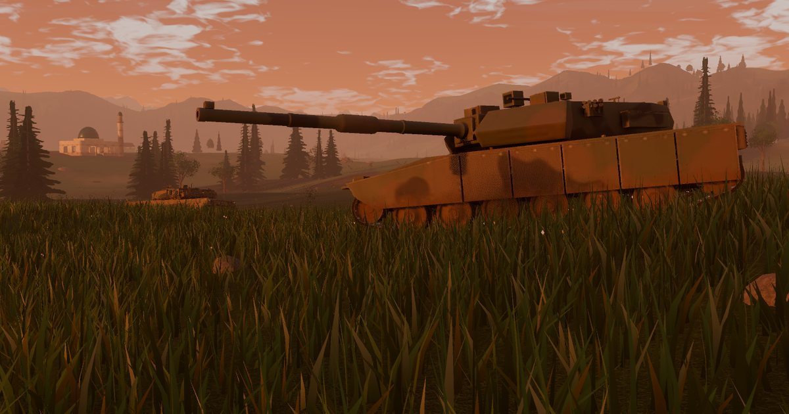

# Iron Monsoon — Modern Tank Warfare

Game tank modern gratis untuk **Windows**, **macOS** dan **Android**. Pimpin tank tempur di lembah tropis: armor dan balistik dihitung per tembakan, cuaca berganti tiap pertempuran, dan lawanmu bisa AI atau pemain lain.

## Unduh

| Platform | File |
| --- | --- |
| Windows 10 / 11 (64-bit) | [IronMonsoon-Windows.zip](https://github.com/yayandev/iron-monsoon/releases/latest/download/IronMonsoon-Windows.zip) |
| macOS 11+ (Apple Silicon & Intel) | [IronMonsoon-macOS.zip](https://github.com/yayandev/iron-monsoon/releases/latest/download/IronMonsoon-macOS.zip) |
| Android 7.0+ (64-bit) | [IronMonsoon-Android.apk](https://github.com/yayandev/iron-monsoon/releases/latest/download/IronMonsoon-Android.apk) |

Situs: https://iron-monsoon.vercel.app  ·  Semua versi: [Releases](https://github.com/yayandev/iron-monsoon/releases)

## Isi game

- 13 tank dari 9 negara, dari MT Harimau dan Leopard 2RI sampai K2 Black Panther
- Penetrasi APFSDS / HEAT vs armor efektif, pantulan, modul rusak, api dan kru
- 8 operasi: gelombang, rebut wilayah, pemburu, sergap konvoi, serbuan fajar, dan lainnya
- Cuaca: cerah, fajar, senja, kabut, hujan badai
- Online: co-op vs AI (1–4), duel 1v1 berperingkat, tim 5v5 — PC, Mac dan Android di server yang sama
- Android: kontrol sentuh, HUD ringkas, resolusi render dinamis

## Cara menjalankan

**Windows** — ekstrak zip, jalankan `IronMonsoon.exe`. Jika muncul *Windows protected your PC*, klik **More info → Run anyway**.

**macOS** — buka zip, pindahkan `Iron Monsoon.app` ke Applications. Pertama kali: **klik kanan → Open**, atau **System Settings → Privacy & Security → Open Anyway**.

**Android** — unduh dan buka `IronMonsoon-Android.apk`, izinkan *Instal aplikasi tidak dikenal* untuk browser bila diminta; jika Play Protect bertanya, pilih **Tetap instal**.

Dibuat dengan [Godot Engine](https://godotengine.org).
